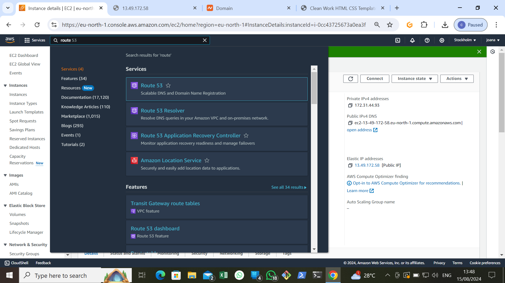

# create an ubuntu folder

- locate and click on **EC2** within the AWS management console

- click on **Launch instance**

- name your instance, abd select ubuntu AMI. Go ahead and create new key pair, enable **SSH**. **HTTP**, and **HTTPS** and proceed to launch instance.

>[NOTE]
for security reason, it's recommended to restrict SS acces to your IP address only.

- click on view instances, on the created instance, then click on **connect** button.

- copy the command provided under **SSH client**.

- Open a terminal in directory where your .pem file was downloaded, paste the command and press enter.

# create and assign an elastic IP

- return to AWS console and click on menu icon to open dashboard menu. then select **elastic IPs**, click on the associate elastic IP ADDRESS button and click **Associate**.

> Note 
The IP Address for your instance has been updated to the elastic IP associated with it.

- paste the command into yor terminal and press enter.

# Intall Nginx and setup your website

- Start your nginx server

- go back to your Ec2 dashboard and copy your **Public IP Address**.

- visit your instances public IP address in a web browser to view the default nginx page.

- Download your website template from tooplate.com and obtain the download URL from the website.

- Open a web browser and go to yuor **Public IPv4 address** to confirm that or website is working as expected.

# create an A Record

- On the website click on **Domain list**

- click the manage button

- Go back to yor AWSconsole, search for **Route 53** and then choose Route 53 from the list of services shown.

- click on **Get started**

- Select **create hosted zone** and click on **Get started**

- Enter you domain name, choose public hosted zone and then clck on create hosted zone.

-select the created hosted zone and copy the assigned values

# Install certbot and Request for an SSL certificate

- install certbot by executing the following commands: **sudo apt update sudo apt install certbot python3-certbot-nginx**

- Execute the **sudo cert-bot --nginx** command to request your certificate. Follow the instructions provided by certbot.

- Verify the website's SSL using the OpenSSL utility with the command: **openssl s_client -connect nkoloagu.online:443

- visit **https://nkoloagu.online** to view your website.

# The End of project 1

